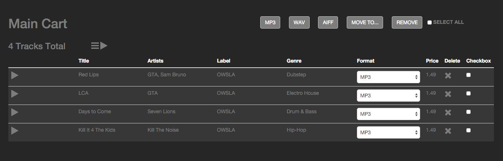

#Semantic Markup

##Challenge

Re-create LeetPort's checkout page by hand utilizing semantic markup. Be sure to get the page to look as close as possible to the image.

##Resources
- [MDN HTML5 Guide](https://developer.mozilla.org/en-US/docs/Web/Guide/HTML/HTML5)
- [HTML5 DOCTOR](http://html5doctor.com/)
- [Bootstrap](http://getbootstrap.com/)
